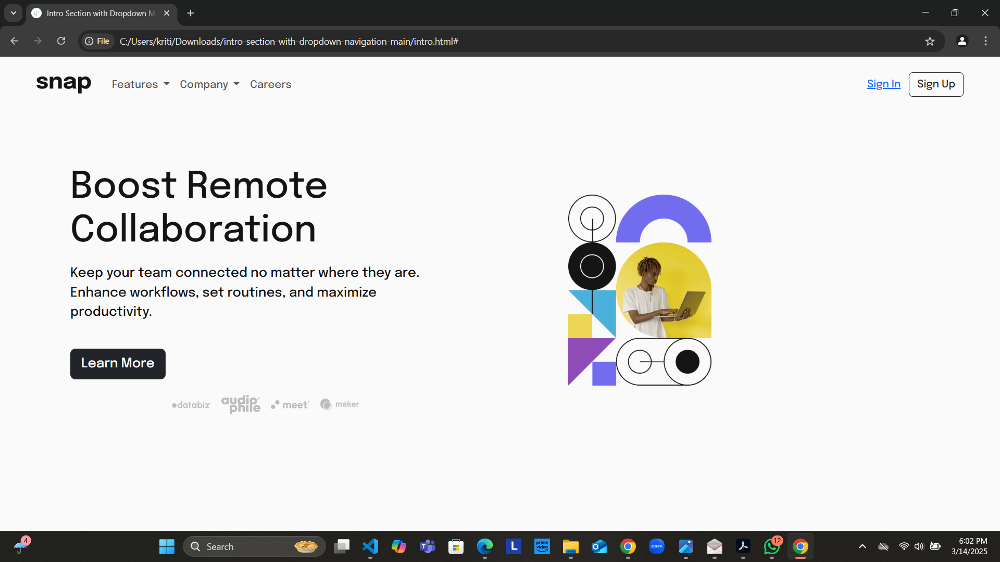
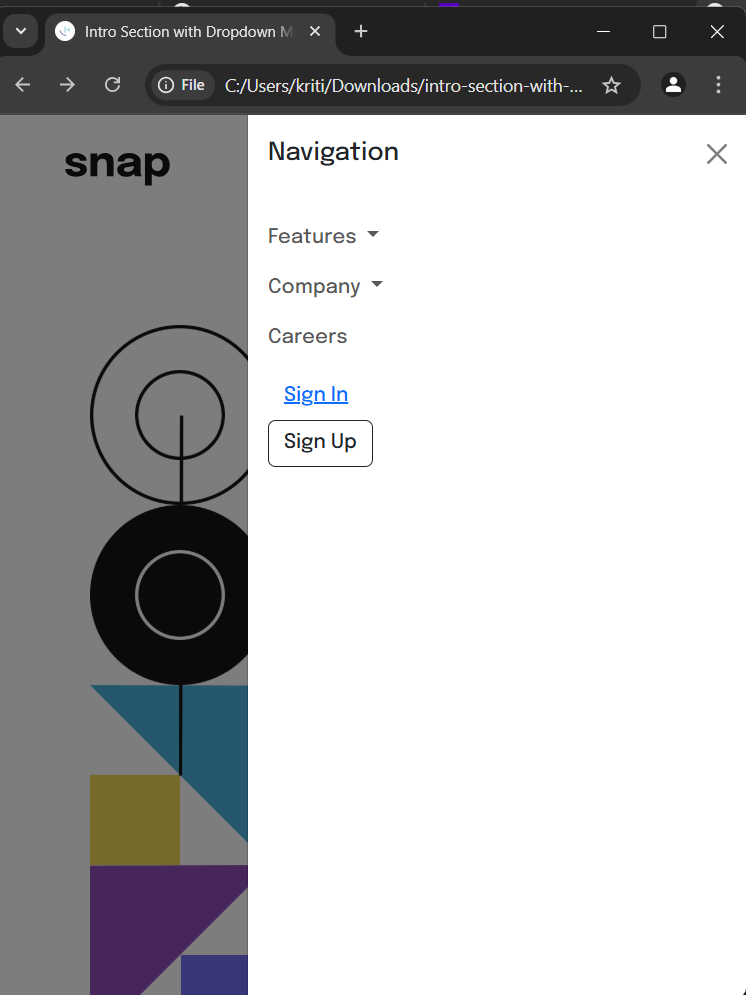

# mtm6404-frontend-mentor-
## Challenge: Intro Section with Dropdown Navigation

*Name:* Kritika
*Student Number:* 90541130242
Welcome to the Frontend Mentor challenge! 🚀

This project is an intro section with dropdown navigation, where the goal is to build the layout and functionality as closely as possible to the provided design.

## Table of Contents

- [Overview](#overview)
- [The Challenge](#the-challenge)
- [Screenshots](#screenshots)
- [Links](#links)
- [Built with](#built-with)
- [Getting Started](#getting-started)
- [Deployment](#deployment)
- [Acknowledgments](#acknowledgments)

## Overview

In this challenge, you’ll build an intro section with dropdown navigation, ensuring that your users can interact with the menu on both mobile and desktop devices. You'll need to focus on responsive design and user interaction.

## The Challenge

Your challenge is to build out this intro section with dropdown navigation, and get it looking as close as possible to the design provided.

**Users should be able to:**

- View the relevant dropdown menus on desktop and mobile when interacting with the navigation links.
- View the optimal layout for the content depending on their device’s screen size.
- See hover states for all interactive elements on the page.

## Screenshots

| Desktop View        | Mobile View        |
|---------------------|---------------------|
|  |  |


## Built with

- HTML
- CSS (Bootstrap 5)
- JavaScript
- Responsive design

## Getting Started

### Installation

1. Clone the repository:
   ```bash
   git clone https://github.com/Kritika883/frontmentor_challenge/blob/main/README.MD
